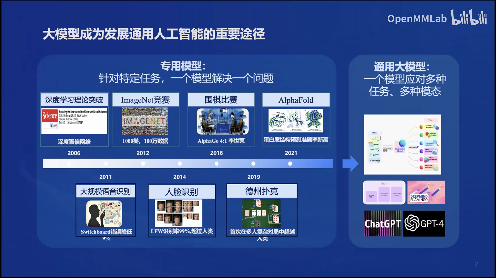
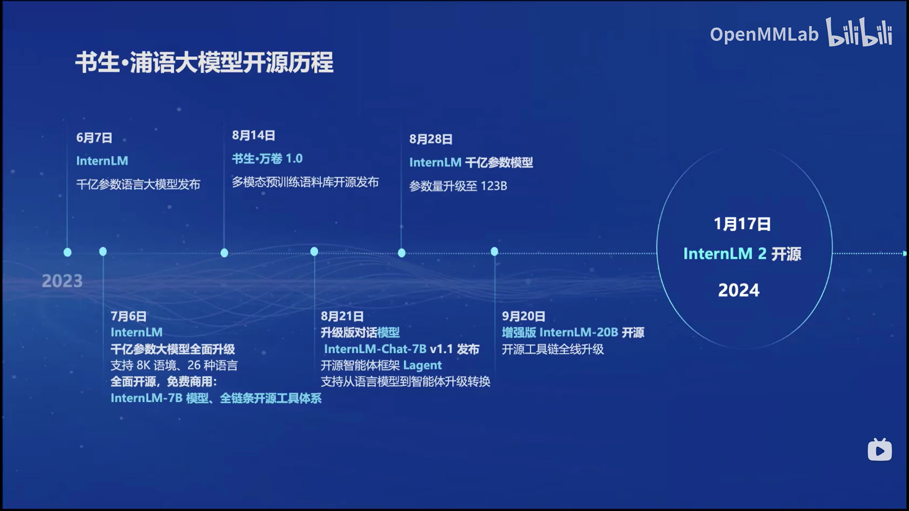
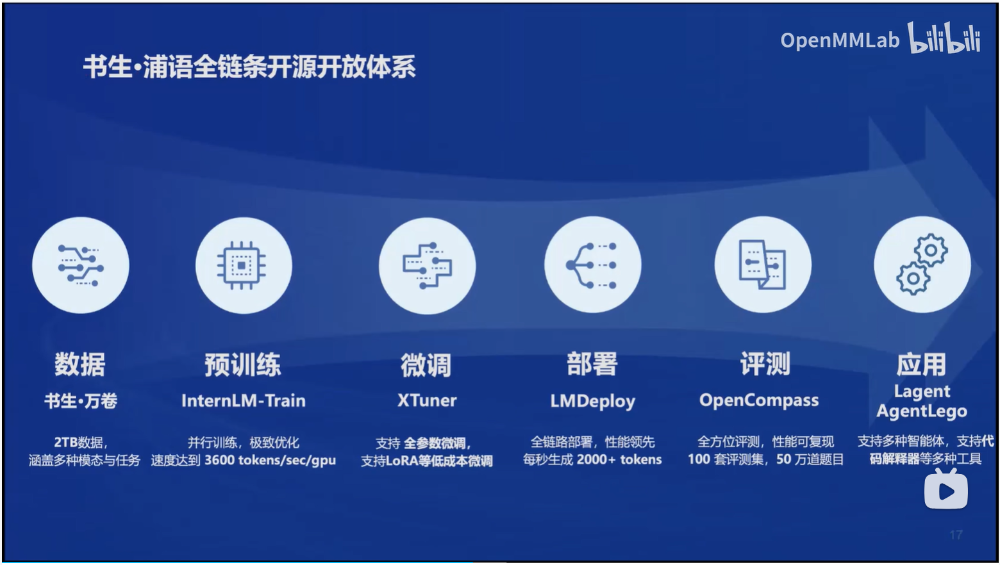
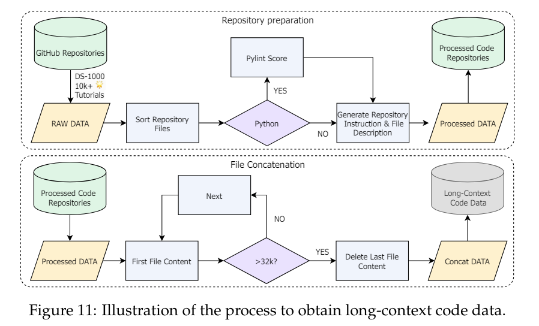

# 书生·浦语大模型全链路开源开放体系--课堂笔记

大模型成为发展通用人工智能的重要途径：

## 书生·浦语大模型开源历程

**主要亮点：**
20w token上下文窗口上下文；推理、数学、代码能力

## 书生·浦语全链路开源开放体系

# 技术报告读书笔记
这篇技术报告深入介绍了一种名为InternLM2的开源大型语言模型。
该模型在多维评估中超越了先前的模型，尤其在长文本建模和主观评估方面表现出色。

长文本能力训练

研究团队通过创新的预训练和优化技术，提高了模型的表现。预训练过程中，模型使用了包括文本、代码和长文本数据的多样化数据，并有效捕捉长期依赖关系。此外，InternLM2在监督微调(SFT)和一种新颖的条件在线强化学习（COOL RLHF）策略下进一步对齐，解决了人类偏好之间的冲突和奖励黑客问题。最后，通过发布不同训练阶段和模型大小的InternLM2模型，研究团队为社区提供了模型演化的见解。